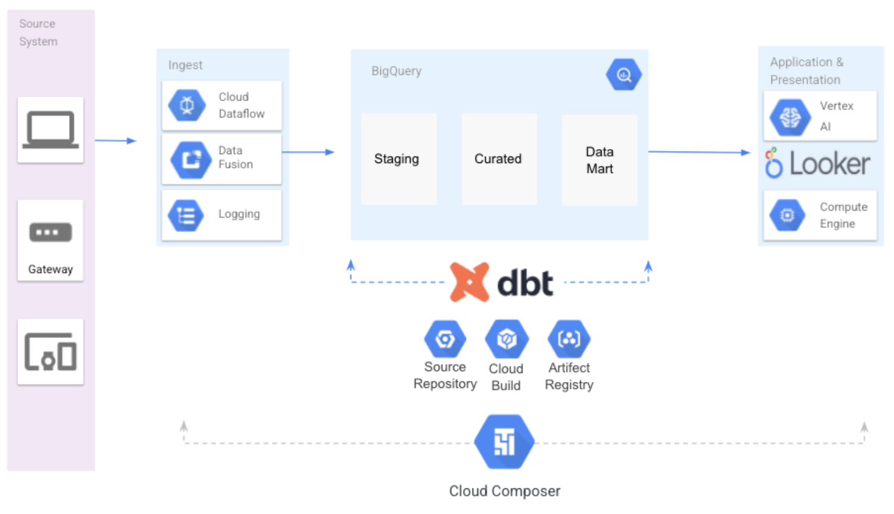

# Dbt BigQuery Integration Demo

Data Build Tool (dbt) is a cutting-edge open-source data modeling and transformation tool. It enables engineers and data analysts to transform and structure data in a dependable and scalable manner. Dbt is used to build data pipelines for data warehousing and business intelligence applications.

Dbt aids in automating the process of creating data models. Users can create SQL queries and use code to automate repetitive activities. Additionally, it provides functions like testing and version control that guarantee the consistency and accuracy of the data. Snowflake, Redshift, BigQuery, and other databases are among the many that dbt can operate with.


***Figure 1***

In this demo, we demostrate how to use the dbt with BigQuery for the SQL pipeline generation, test autumation and documentation generation. We also demostrate how to integrate the dbt with the orchestration serivce Cloud Composer, and how to implement the CI/CD process with dbt and Cloud Build.

## Solution Architecture

Here is the solution architecure to build a ELT data analytics pipeline on BigQuery using dbt and other Google Cloud native tooling. 



***Figure 2***

As shown in the architecture diagram, dbt is responsible for developing and running the ELT pineline inside BigQuery. Cloud Composer (managed Airflow Service) is responsible for end-to-end data pipeline orchestration, including data ingestion and data extraction. The dbt pipeline is integrated with Cloud Composer as part of the DAG workflow. The other important tools in this solution include:
* Google Source Repository (GSR) -   Provides Git version control to support collaborative development of any application or service; basically "Git server hosted in the cloud"
* Google Cloud Build (GCB) - Allow users to create fast, consistent, reliable builds across all languages. Automatically build containers or *non-container artifacts on commits to your Git repository.
* Artifact Registry (AR) - Evolution of Container Registry, single place for container images and language packages (such as Maven and npm)


## Environment variables

Change these varaibles in your environment

```bash
export PROJECT=lufeng-demo
export SUBNET=default
export DBT_VM=dbt
export DBT_DATASET=dbt
export LOCATION=US
```

## Deploy dbt demo
We need to deploy the dbt client and configure it to connect to BigQuery

### 1. Create a VM 
```
gcloud compute instances create ${DBT_VM} \
  --project ${PROJECT} \
  --zone us-central1-a \
  --machine-type n1-standard-2 \
  --subnet ${SUBNET} \
  --scopes https://www.googleapis.com/auth/cloud-platform
```

### 2. install the dbt CLI
dbt core is an open source command line tool. To start to develop a dbt project, you need to follow the [instruction](https://docs.getdbt.com/dbt-cli/installation) to install the dbc CLI in your client machine. 

The latest version of dbt-core is compatible with Python versions 3.7, 3.8, 3.9, and 3.10. Also, we recommend installing dbt in the python virtual environment.
```
python3 --version

sudo apt-get install python3-venv

python3 -m venv dbt-env             # create the environment
source dbt-env/bin/activate         # activate the environment

pip install --upgrade pip wheel setuptools
pip install dbt-core
pip install dbt-bigquery
```

### 3. Create a BigQuery dataset for the demo
```
bq mk --dataset --location=US --project_id=${PROJECT} $DBT_DATASET
```

### 4. Configure the Demo
Clone the demo code
```
sudo apt-get install git
git clone https://github.com/lufeng76/dbt-demo.git
```

You need to set up a `profiles.yml` file to connect to BigQuery. By default, `profile.yml` file is located in `~/.dbt/profiles.yml` . However, we have a `profiles.yml` file located in the demo directory.
```
export DBT_PROFILES_DIR=~/dbt-demo/
```

Edit the `profiles.yml` file in `$DBT_PROFILES_DIR`, modify the following configuration the target `dev`:
* `keyfile` - The service account key file
* `project` - The default GCP project id
* `dataset` - The default dataset which all dbt models are built in

Here is an example
```
profile-name: # this needs to match the profile: in your dbt_project.yml file
 target: dev
 outputs:
   dev:
     type: bigquery
     method: service-account
     keyfile: /dbt/keyfile.json         # replace this with the full path to your keyfile
     project: lufeng-demo               # Replace this with your project id
     dataset: dbt                       # Replace this with dbt_your_name, e.g. dbt_bob
     threads: 1
     job_execution_timeout_seconds: 300
     location: US
     priority: interactive


   prod:
     type: bigquery
     method: service-account
     project: [GCP project id]
     dataset: [the name of your dbt dataset]
     threads: [1 or more]
     keyfile: [/path/to/bigquery/keyfile.json]
     job_execution_timeout_seconds: 300
     priority: interactive
     retries: 1
```

### 5. Run the demo

```
cd ~/dbt-demo/demo

dbt build
```

## Integration with Cloud Composer
