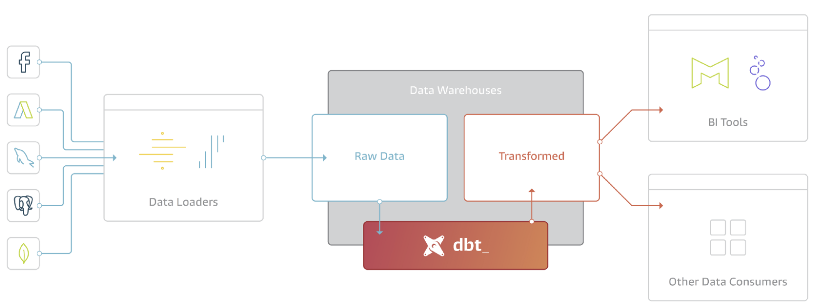
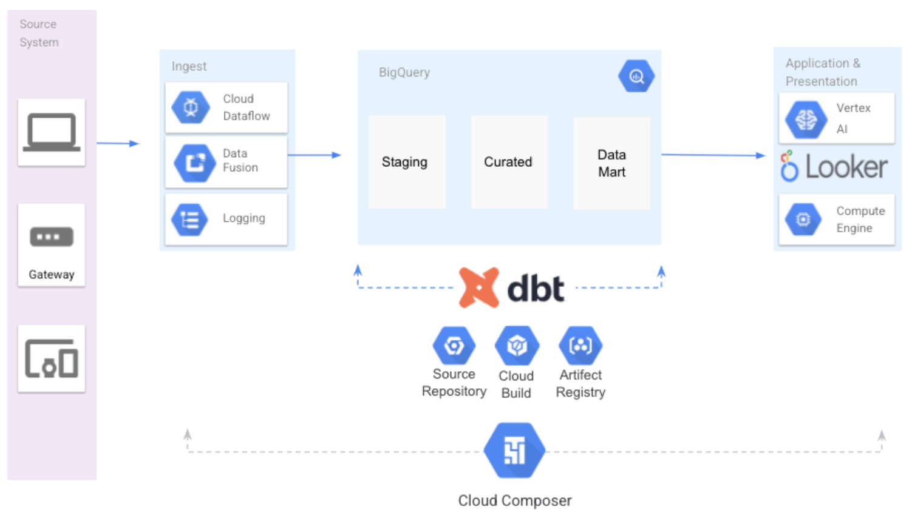
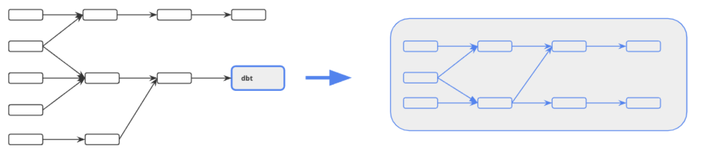

# dbt BigQuery Integration Demo

Data Build Tool (dbt) is a cutting-edge open-source data modeling and transformation tool. It enables engineers and data analysts to transform and structure data in a dependable and scalable manner. Dbt is used to build data pipelines for data warehousing and business intelligence applications.

Dbt aids in automating the process of creating data models. Users can create SQL queries and use code to automate repetitive activities. Additionally, it provides functions like testing and version control that guarantee the consistency and accuracy of the data. Snowflake, Redshift, BigQuery, and other databases are among the many that dbt can operate with.



***Figure 1***

In this demo, we demostrate how to use the dbt with BigQuery for the SQL pipeline generation, test autumation and documentation generation. We also demostrate how to integrate the dbt with the orchestration serivce Cloud Composer, and how to implement the CI/CD process with dbt and Cloud Build.

## Solution Architecture

Here is the solution architecure to build a ELT data analytics pipeline on BigQuery using dbt and other Google Cloud native tooling. 



***Figure 2***

As shown in the architecture diagram, dbt is responsible for developing and running the ELT pineline inside BigQuery. Cloud Composer (managed Airflow Service) is responsible for end-to-end data pipeline orchestration, including data ingestion and data extraction. The dbt pipeline is integrated with Cloud Composer as part of the DAG workflow. The other important tools in this solution include:
* Google Source Repository (GSR) -   Provides Git version control to support collaborative development of any application or service; basically "Git server hosted in the cloud"
* Google Cloud Build (GCB) - Allow users to create fast, consistent, reliable builds across all languages. Automatically build containers or *non-container artifacts on commits to your Git repository.
* Artifact Registry (AR) - Evolution of Container Registry, single place for container images and language packages (such as Maven and npm)


## Environment variables

Change these varaibles in your environment

```bash
export PROJECT=lufeng-demo
export SUBNET=default
export DBT_PROJECT=~/dbt-demo2
export DBT_DATASET=dbt
export LOCATION=US
```

## Deploy dbt demo
We need to deploy the dbt client and configure it to connect to BigQuery


### 1. install the dbt CLI
dbt core is an open source command line tool. To start to develop a dbt project, you need to follow the [instruction](https://docs.getdbt.com/dbt-cli/installation) to install the dbc CLI in your client machine. 

The latest version of dbt-core is compatible with Python versions 3.7, 3.8, 3.9, and 3.10. Also, we recommend installing dbt in the python virtual environment.

From Cloud Shell, execute the following to install dbt:
```bash
pip3 uninstall dbt-core
pip3 install --user --upgrade dbt-bigquery
```

Verify that this is installed correctly by executing:
```bash
dbt --version
```

### 2. Configure the Demo
Clone the demo code
```
sudo apt-get install git
git clone https://github.com/lufeng76/dbt-demo2.git
```

You need to set up a `profiles.yml` file to connect to BigQuery. By default, `profile.yml` file is located in `~/.dbt/profiles.yml` . However, we have a `profiles.yml` file located in the demo directory.
```
export DBT_PROFILES_DIR=$DBT_PROJECT
```

Edit the `profiles.yml` file in `$DBT_PROFILES_DIR`, modify the following configurations:
* `keyfile` - The service account key file. You need to generate the key file from the cloud console
* `project` - The default GCP project id
* `dataset` - The default dataset which all dbt models are built in

Here is an example
```
bigquery_bank: # this needs to match the profile: in your dbt_project.yml file
  target: dev
  outputs:
    dev:
      type: bigquery
      method: service-account
      keyfile: /dbt/keyfile.json # replace this with the full path to your keyfile
      project: lufeng-demo       # Replace this with your project id
      dataset: dbt               # Replace this with dbt_your_name, e.g. dbt_bob
      threads: 4
      job_execution_timeout_seconds: 300
      location: US
      priority: interactive
```

### 3. Install the dbt dependency
Install dbt dependencies, as indicated in the <walkthrough-editor-open-file filePath="dbt/packages.yml">dbt/packages.yml</walkthrough-editor-open-file> file.

```bash
cd $DBT_PROJECT/dbt
dbt clean
dbt deps
```

### 4. Load the external tables
Execute the following:
```bash
bq mk --dataset --location=US --project_id=${PROJECT} raw

cd $DBT_PROJECT/dbt
dbt run-operation stage_external_sources
```

This takes the GCS files listed in <walkthrough-editor-open-file filePath="dbt/models/raw/external_tables.yml">dbt/models/raw/external_tables.yml</walkthrough-editor-open-file>, and creates corresponding external tables in BigQuery within the `raw` dataset.

For this tutorial, the data will come from a public Google Cloud Storage bucket `gs://williamtsoi-bigquery-bank-demo/`. In your use case you may use data that has been Extract-Loaded by your platform of choice.

### 5. Generate base staging schema
Execute the following:

```bash
cd $DBT_PROJECT/dbt
dbt compile
```

This will execute the jinja macros from the `dbt/analyses` directory, such as <walkthrough-editor-open-file filePath="dbt/analyses/stg_card_transactions.sql">dbt/analyses/stg_card_transactions.sql</warkthrough-editor-open-file>:

```
{{ codegen.generate_base_model(
    source_name='raw',
    table_name='ext_card_transactions'
) }}
```

This macro will inspect the table schema of the `ext_card_transactions` external table in the `raw` dataset, and will generate a base SQL model for the staging schema.

The generated SQL models will be placed in the `dbt/target/compiled/bigquery_bank/analyses` directory. For example, the corresponding base schema generated for the `ext_card_transactions` table is:

```sql
with source as (

    select * from {{ source('raw', 'ext_card_transactions') }}

),

renamed as (

    select
        cc_number,
        trans_id,
        trans_time,
        epoch_time,
        category,
        merchant,
        merchant_lat,
        merchant_lon,
        amount,
        is_fraud,
        trans_date

    from source

)

select * from renamed
```

### 6. Define staging schema

Normally what happens here is that you will need to model the staging schema in the `dbt/models/staging` directory, based on the generated base schema files in `dbt/target/compiled/bigquery_bank/analyses` in the previous step.

This is the place where you will define partition/clustering for the tables. For example, in <walkthrough-editor-open-file filePath="dbt/models/staging/stg_card_transactions.sql">dbt/models/staging/stg_card_transactions.sql</walkthrough-editor-open-file>, we have added an additional config block on the top of the model file to define partitioning by the `trans_date` column:

```sql
{{ config(
    materialized='table',
    partition_by={
      "field": "trans_date",
      "data_type": "date",
      "granularity": "day"
    }
)}}

with source as (

    select * from {{ source('raw', 'ext_card_transactions') }}

),

renamed as (

    select
        cc_number,
        trans_id,
        trans_time,
        epoch_time,
        category,
        merchant,
        merchant_lat,
        merchant_lon,
        amount,
        is_fraud,
        trans_date

    from source

)

select * from renamed
```

For the purpose of this tutorial though, the staging schemas have already been defined and so there's no action required here.

### 7. Deploy schema

Deploy the staging schema into BigQuery by executing:

```bash
cd $DBT_PROJECT/dbt
dbt run
```

### 8. Execute Data Tests

Execute the data tests in BigQuery by executing:

```bash
cd $DBT_PROJECT/dbt
dbt test
```

Tests are defined in the `dbt/models/staging/stg_bigquery_bank.yml`, as well as `dbt/tests/*.sql`.

### 9. Generate docs

dbt comes with some powerful documentation generation facilities. Once the data model has been deployed, you can generate a document website using the following command.

```bash
cd $DBT_PROJECT/dbt
dbt docs generate
```

This will generate the data catalog json file.

### 10. Serve documentation website

Now to serve the website, run the following commands:

```bash
cd $DBT_PROJECT/dbt
dbt docs serve
```

Next, click on the <walkthrough-spotlight-pointer spotlightId="devshell-web-preview-button">web preview icon
</walkthrough-spotlight-pointer> at the top right of the window and click "Preview on port 8080".

When you are done browsing the documentation website, ensure that you press `Ctrl-C` to stop the web server and to bring you back to the shell.

## Integration with Cloud Composer

As shown in the architecture diagram below, dbt is responsible for the ELT pineline inside BigQuery. Cloud Composer is responsible for end-to-end data pipeline orchestration, including data ingestion and data extraction. The dbt pipeline is integrated with Cloud Composer as part of the DAG workflow.



***Figure 3***

dbt core is a command line tool, and can be packaged into a container image file. Then, Cloud Composer can run the dbt pipeline using `KubernetesPodOperator` in the gke cluster which run the Composer. `KubernetesPodOperator` launches Kubernetes pods in your environment's cluster.


### 1. Build and deploy the dbt docker image to the Artefact Registry

```bash
cd $DBT_PROJECT
gcloud builds submit --region=us-central1 --config=cloudbuild.yml .
```

### 2. Create a Cloud Composer instance and deploy the DAG

Create a Cloud Composer 2 instance
```bash
gcloud composer environments create airflow1 \
    --location us-central1 \
    --image-version composer-2.4.6-airflow-2.6.3
```

Upload `dbt_dag.py` to the DAGs folder in the instance, and then manually trigger the DAG. You need to change your image Artifact name

## CI/CD pipeline
Cloud Build uses build triggers to enable CI/CD automation. You can configure triggers to listen for incoming events, such as when a new commit is pushed to a repository or when a pull request is initiated, and then automatically execute a build when new events come in.

dbt can be easily integrated with the Cloud Build and the source repository, such as Github or Gitlab, to build a CI/CD pipeline. 

Here is the workflow:
* The developer change the code, and run the unit test in there local dev environment
* The developer decide to commit the code change and merge into the main branch
* The merge action trigger the Cloud Build script
* Build the dbt container image
* Run the integration test
* Push the image to the container registry
* Cloud composer pull the latest dbt image


